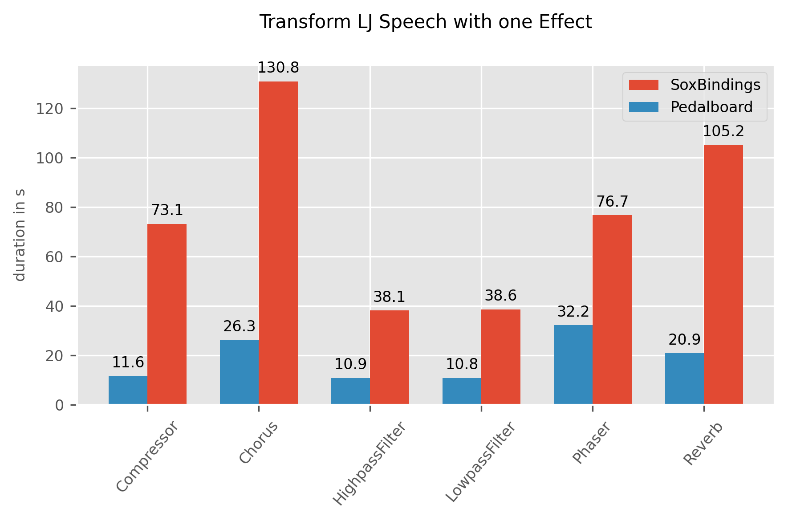
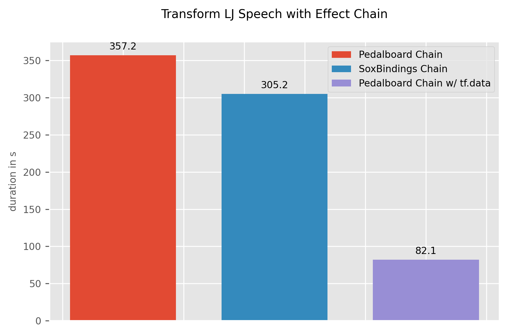

# High Perfromance Audio Processing with tf.data and Pedalboard

Evaluating the processing speed of [Pedalboard](https://github.com/spotify/pedalboard) library in comparison with the [SoxBindings](https://github.com/pseeth/soxbindings) library, when used inside a tf.data map call.

### Results for Single Effect Transformation

### Results for Effect Chain Transformation
